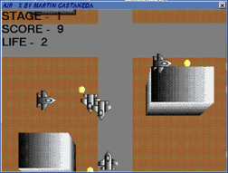



## \_\*\*A Cool Shoot the Enemy Aircraft Game Game \(Air\-x\)\*\*

### Description

Cool AIR-X Arcade game. Final Battle Edition.

Shoot down enemy aircraft before they shoot you down.

Fast transparent sprite animation over moving background.

Fast collision detection.
 
### More Info
 

             |
---                |---
**Submitted On**   |1999-12-22 03:08:24
**By**             |[martin castañeda](https://github.com/Planet-Source-Code/PSCIndex/blob/master/ByAuthor/martin-casta-eda.md)
**Level**          |Advanced
**User Rating**    |4.1 (95 globes from 23 users)
**Compatibility**  |VB 4\.0 \(16\-bit\), VB 5\.0, VB 6\.0
**Category**       |[Games](https://github.com/Planet-Source-Code/PSCIndex/blob/master/ByCategory/games__1-38.md)
**World**          |[Visual Basic](https://github.com/Planet-Source-Code/PSCIndex/blob/master/ByWorld/visual-basic.md)
**Archive File**   |[CODE\_UPLOAD245312211999\.zip](https://github.com/Planet-Source-Code/martin-casta-eda-a-cool-shoot-the-enemy-aircraft-game-game-air-x__1-4364/archive/master.zip)

